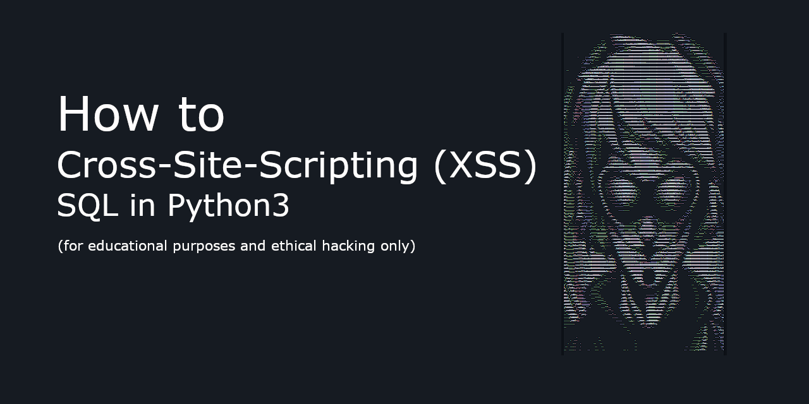

# SQL-Payload (XSS Exploit Script)

###### RedTeam (Balack-Python-Script)
This is a Python script that demonstrates a simple example of a Cross-Site Scripting (XSS) exploit for educational purposes and ethical hacking only. This script is intended to be used responsibly, for learning and understanding the security implications of XSS attacks, and should not be used for any illegal or unethical activities.

## Warning: 
This script is intended for educational and ethical purposes only. The author of this script do not condone illegal activities and are not responsible for any misuse of the extracted dorks. Always use the extracted dorks responsibly and in accordance with the law.

This script is part of a larger collection and was created to be used with caution. This is a Black-Phython-Script it will hack the sql Database of a website. For any damage you will pay, if you do not know what you do!


# Prerequisites
- Python 3.x
- Requests library (can be installed using pip install requests)
## Usage
- Clone the repository or download the script to your local machine.
- Install the required dependencies using pip if not already installed:
```shell
pip install requests
```
Modify the url variable in the script to the URL of the target website that you have permission to test.
Customize the payload variable with the SQL injection code or other malicious code that you want to inject.
Run the script using Python 3:
```shell
python3 sqlpay_xss.py
```
The script will send a request to the target URL with the injected SQL code, and the response will be printed to the console.
## Disclaimer
This script is for educational purposes only and should not be used for any illegal, unethical, or malicious activities. Always ensure that you have proper authorization before conducting any security testing or penetration testing on any website or system. The creator of this script is not responsible for any misuse or damages caused by using this script.

## issues
issues to this script are not accepted as it is intended for educational purposes only and not for production use.
## Credits
[Volkan Kücükbudak](https://github.com/volkansah)

## License
This script is released under the MIT License.

